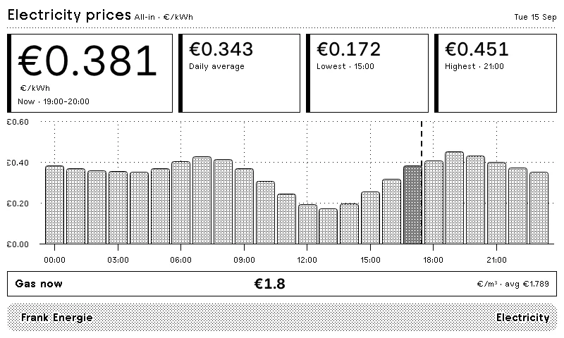
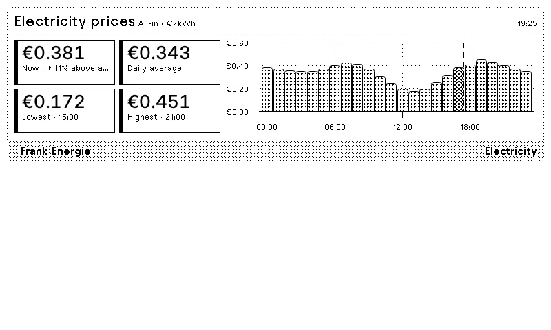
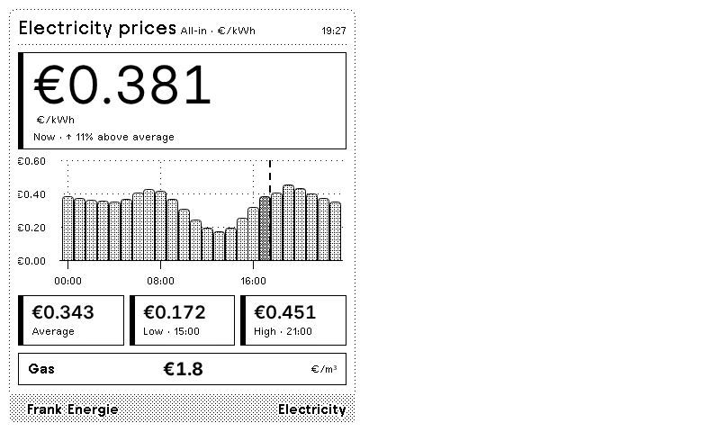
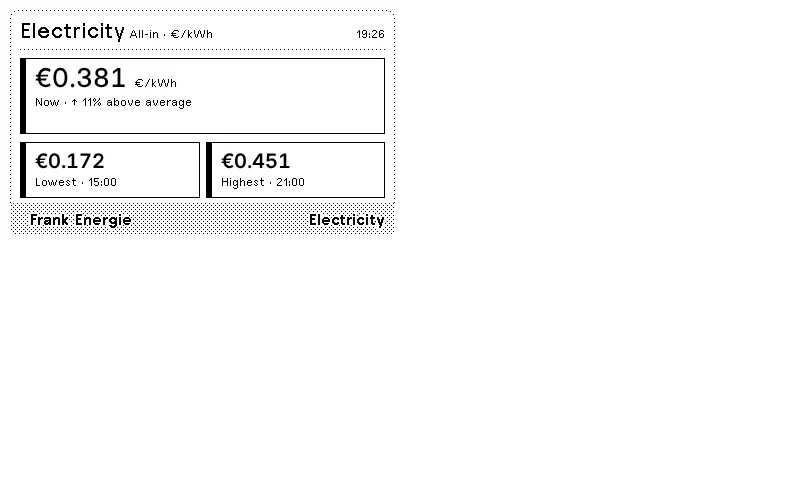
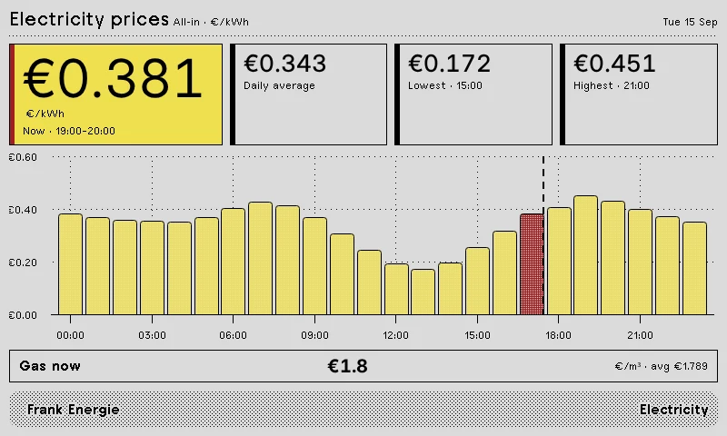
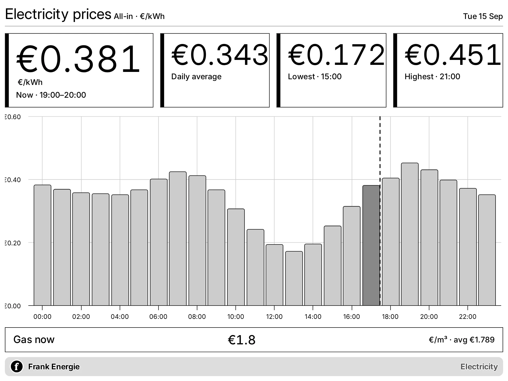
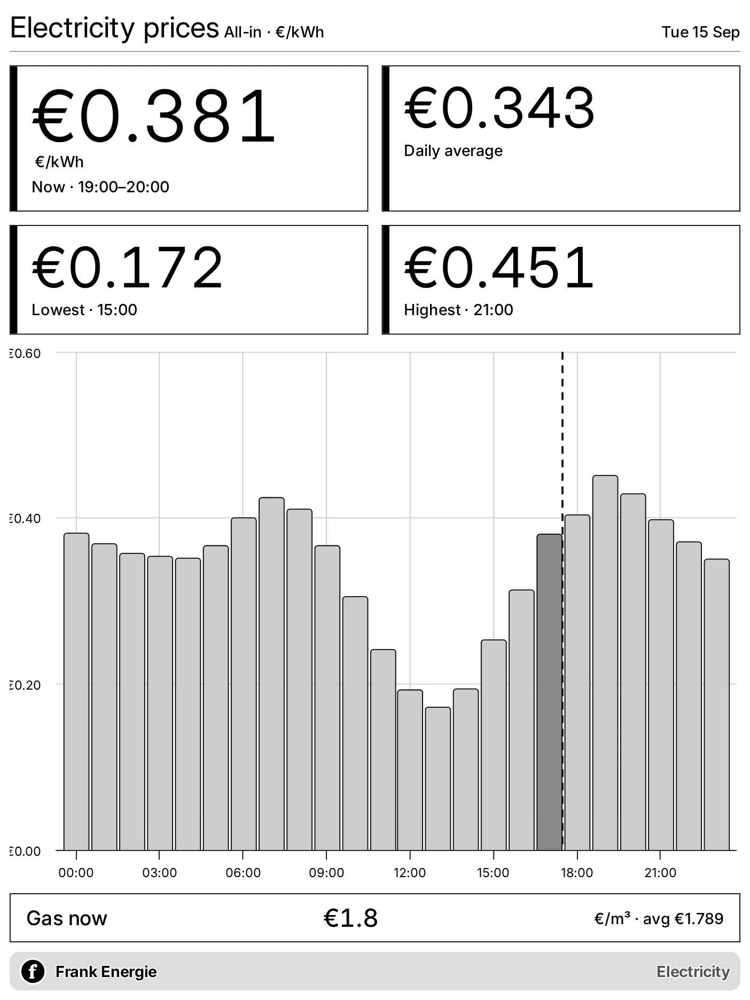

# TRMNL Frank Energie Plugin

A TRMNL plugin that displays current all-in Frank Energie electricity and gas prices.

## Icon

The plugin icon is stored in the TRMNL bundle and referenced from `settings.yml`.

  

## Previews

Previews use a snapshot of public market prices and do not represent current rates.

| Full View | Half Horizontal View |
|------------|----------------------|
|  |  |

| Half Vertical View | Quadrant View |
|-------------------|----------------|
|  |  |

| BWRY Full View |
|----------------|
|  |

| TRMNL X Landscape | TRMNL X Portrait |
|-------------------|------------------|
|  |  |

## Templates

- **shared.liquid**: Resource selection, all-in calculations, time matching, shared components and adaptive chart rendering.
- **full.liquid**: Current, average, lowest and highest prices, the daily chart and the secondary resource.
- **half_horizontal.liquid**: Four primary price metrics beside the daily chart.
- **half_vertical.liquid**: Current price, daily chart, three summary metrics and the secondary resource.
- **quadrant.liquid**: Current, lowest and highest prices without a chart.

The chart uses TRMNL Framework 3.3 paint helpers, so bars, text and grids adapt to grayscale, BWRY, themes and TRMNL X.
