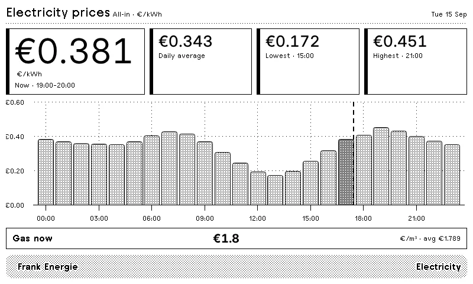
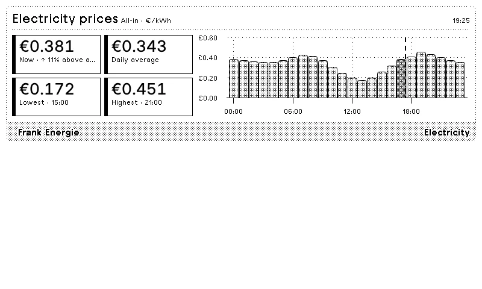
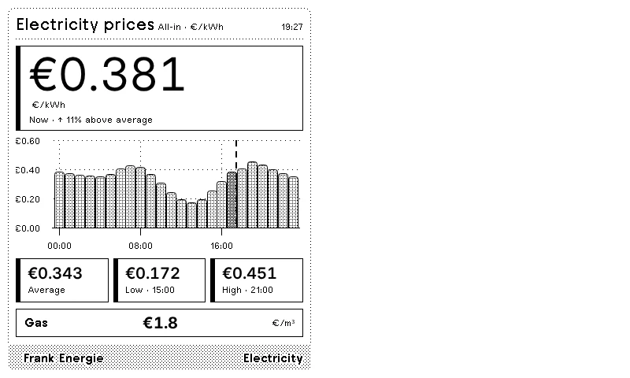
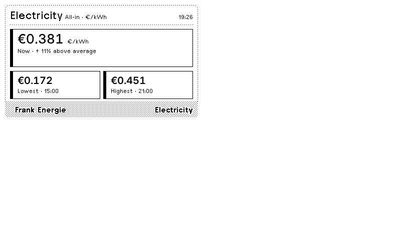
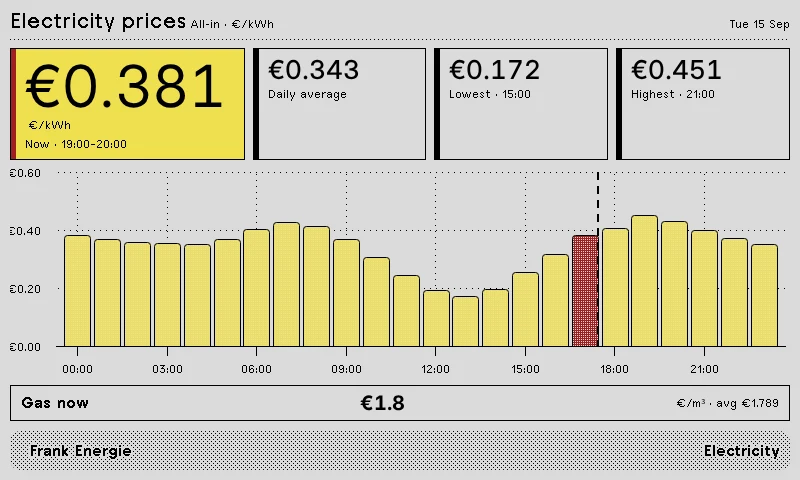
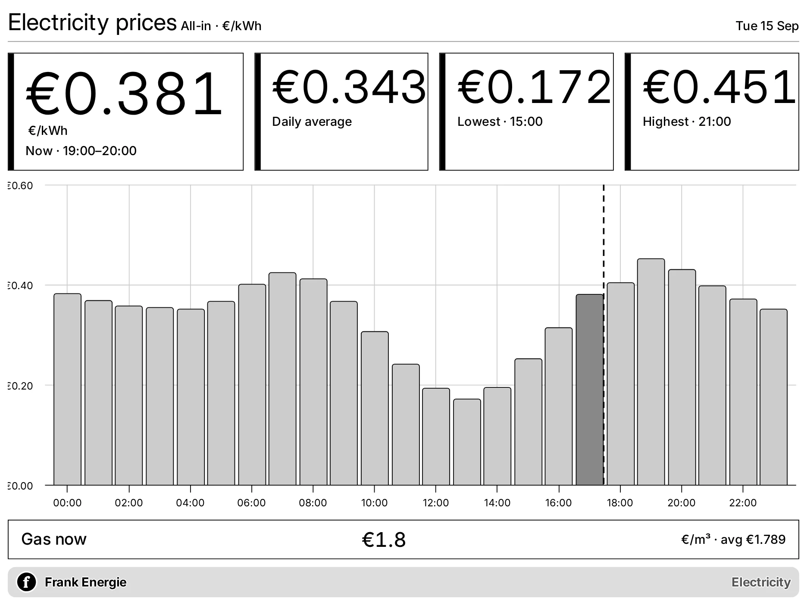
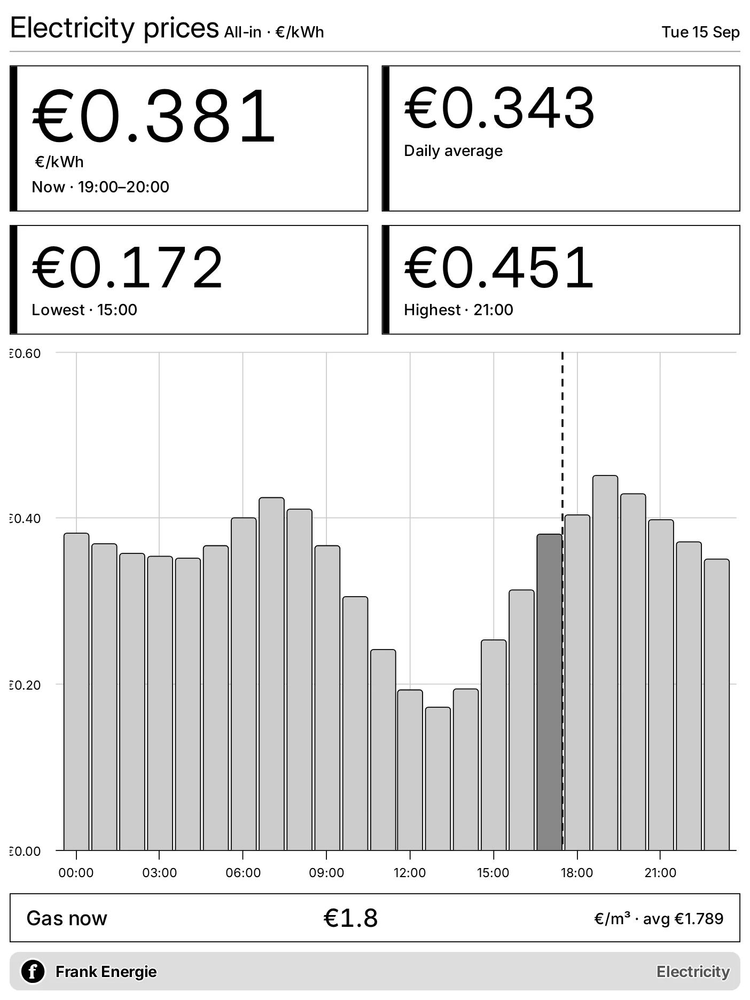

# TRMNL Frank Energie Plugin

A TRMNL plugin that displays current all-in Frank Energie electricity and gas prices.

## Icon

The plugin icon is stored in the TRMNL bundle and referenced from `settings.yml`.

  

## Previews

Previews use a snapshot of public market prices and do not represent current rates.

| Full View | Half Horizontal View |
|------------|----------------------|
|  |  |

| Half Vertical View | Quadrant View |
|-------------------|----------------|
|  |  |

| BWRY Full View |
|----------------|
|  |

| TRMNL X Landscape | TRMNL X Portrait |
|-------------------|------------------|
|  |  |

## Templates

- **shared.liquid**: Resource selection, all-in calculations, time matching, shared components and adaptive chart rendering.
- **full.liquid**: Current, average, lowest and highest prices, the daily chart and the secondary resource.
- **half_horizontal.liquid**: Four primary price metrics beside the daily chart.
- **half_vertical.liquid**: Current price, daily chart, three summary metrics and the secondary resource.
- **quadrant.liquid**: Current, lowest and highest prices without a chart.

The chart uses TRMNL Framework 3.3 paint helpers, so bars, text and grids adapt to grayscale, BWRY, themes and TRMNL X.

## Setup

Choose Electricity or Gas, save, and Force Refresh. Public prices are polled directly from Frank Energie; no personal API key is needed.

## Public recipe review

The original plugin design, parsing logic and markup are also offered under [CC BY 4.0](../LICENSE), matching [TRMNL’s public plugin license](https://trmnl.com/plugin-license). Third-party content keeps its own terms. For support, [open a GitHub issue](https://github.com/taichikuji/trmnl-frank-energie-plugin/issues).

All four layouts render a native title bar. Display icons are monochrome SVGs, so raster dithering is unnecessary. Data requests run in native polling; no Serverless fetch is needed. Chart IDs use TRMNL’s native `append_random` filter to prevent collisions when multiple instances share a mashup.

Before submitting, save each setting in TRMNL, check all four views on OG and X (landscape and portrait), use a public demo preview, and review CHEF feedback. Repository checks and a successful upload do not replace these dashboard checks or human approval.
